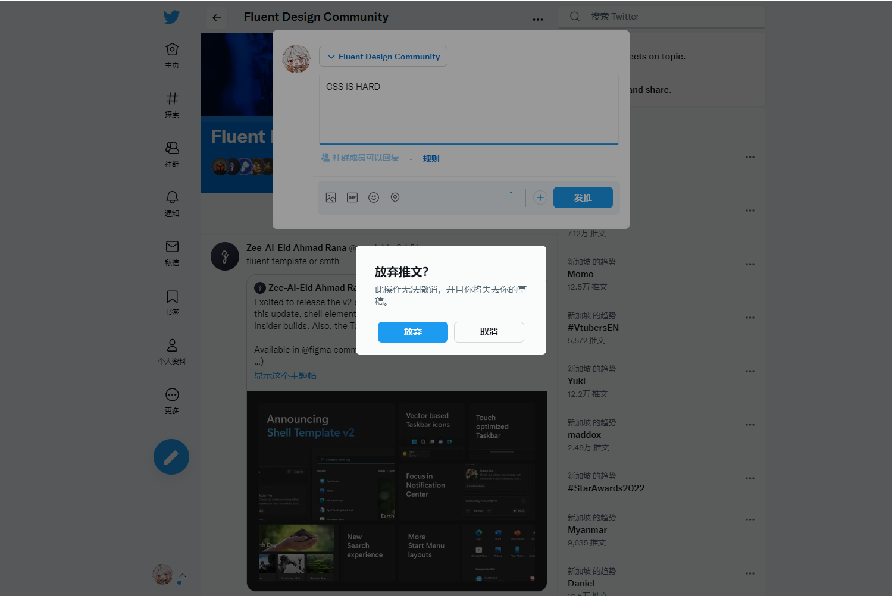

# Twitter-Fluent-Theme
一个适用于推特网页的 CSS 替换主题。/ A css theme for Twitter Web.

# 注意 / Noitce
这是个早期版本，仍有许多样式未被兼容。

This is an early version and there are still many styles that are not compatible.

# 使用 / Usage
使用任意一个可以用来注入 CSS 的浏览器插件（比如：[Amino](https://chrome.google.com/webstore/detail/pbcpfbcibpcbfbmddogfhcijfpboeaaf)），并使用如下 CSS：

Use any browser plugin that can inject CSS (eg. [Amino](https://chrome.google.com/webstore/detail/pbcpfbcibpcbfbmddogfhcijfpboeaaf)) and use the following CSS:
~~~
/**
 * @name Twitter Fluent Theme
 * @author Stapxs
 * @source https://github.com/Stapxs/Twitter-Fluent-Theme
*/

/* Main CSS */
@import "https://stapxs.github.io/Twitter-Fluent-Theme/src/theme.css";

/* Options */
:root {
    /* the width of the main area (except the sidebar) */
    --main-width: 1100px;
    /* the width of the middle part */
    --line-width: 600px;

    
    --main-color: #1d9bf0;          /* theme color */
    --bg-color: #f0f5f8;            /* background color */
    --card-color: #fafcfb;          /* card color */
    --hover-color: #768ea31f;       /* hover color */
}
~~~
